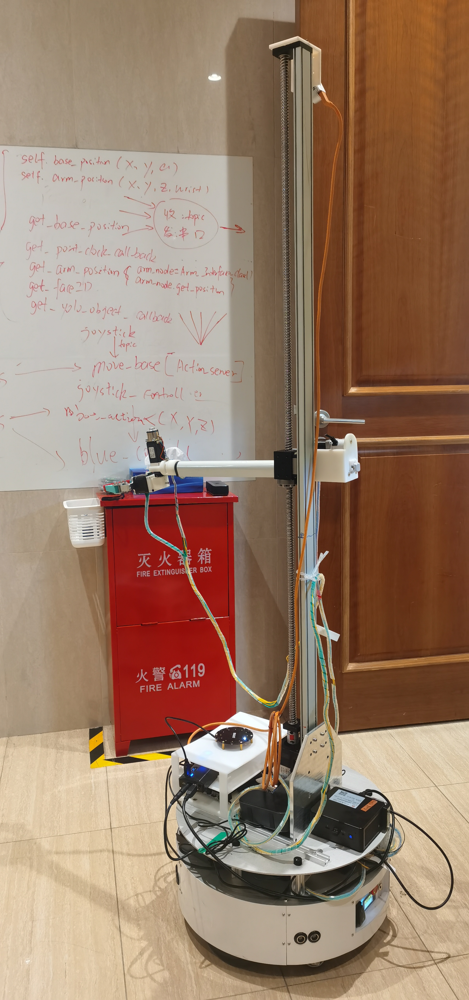
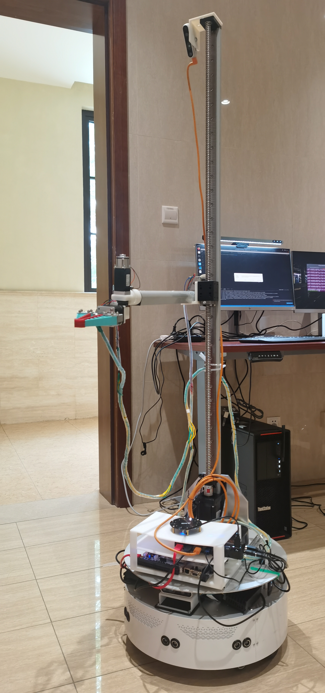
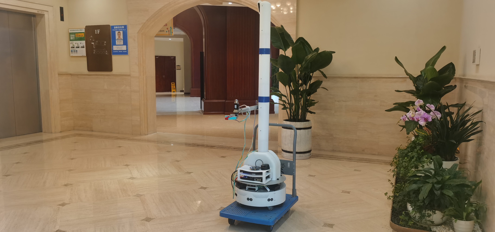
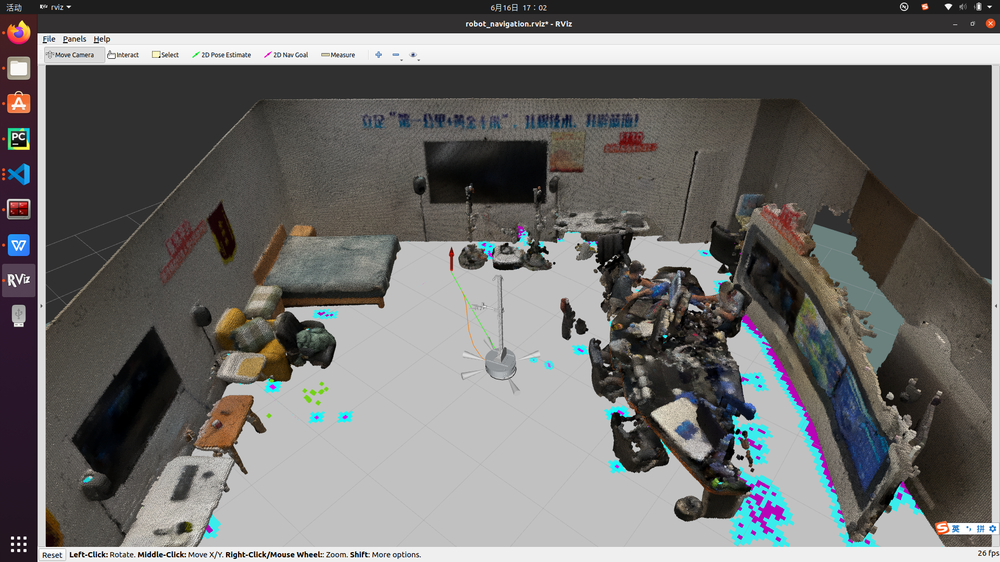
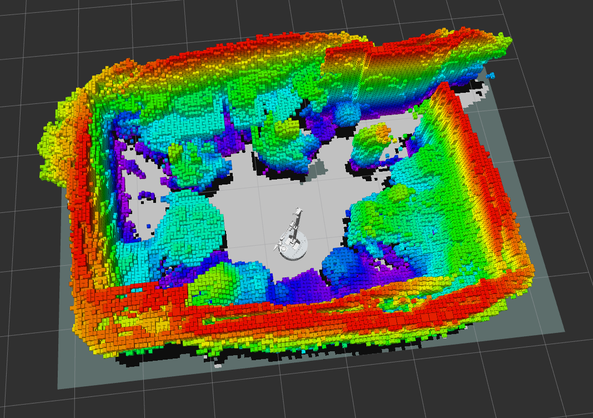
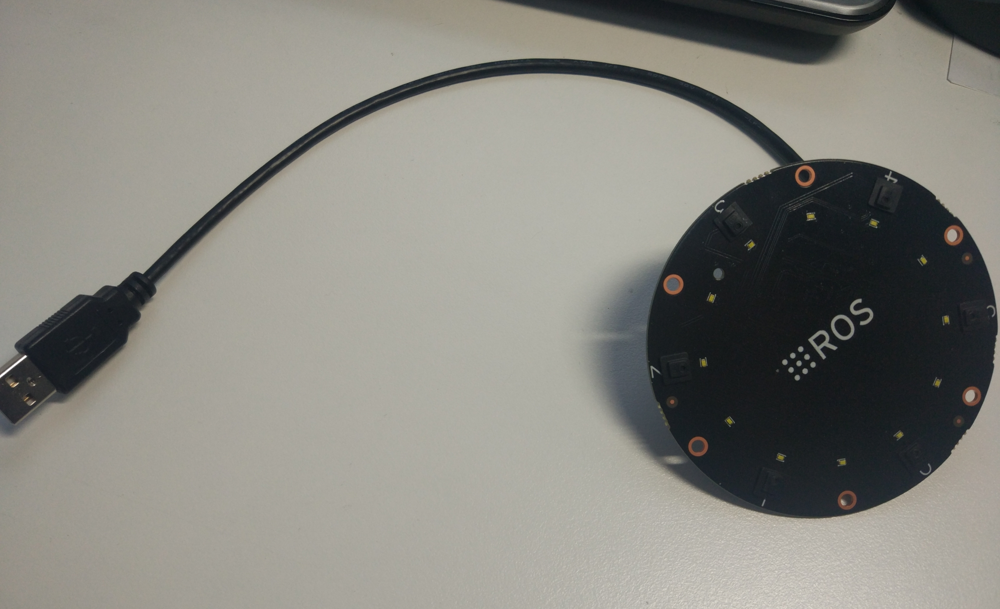
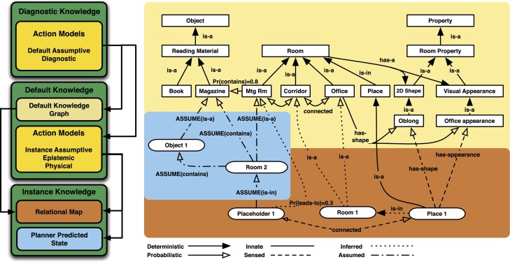
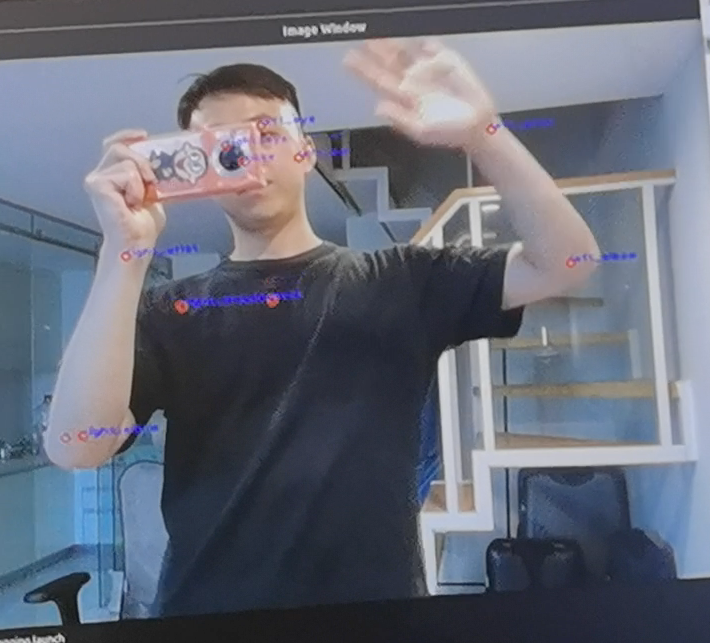
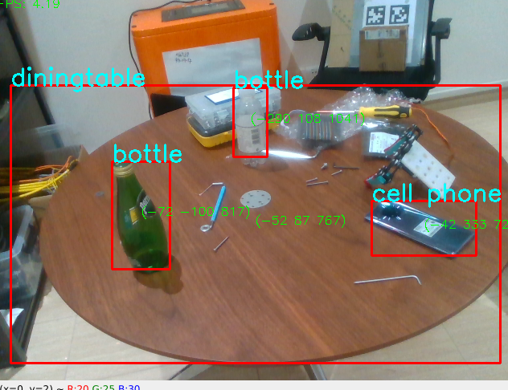

## Preview
This project designs a mobile manipulators for indoor human environments can serve as versatile devices that perform a variety of tasks. The exterior design consists of a two-wheeled differential drive mobile base, a lift, and a telescoping arm configured to achieve Cartesian motion at the end of the arm. The robot is equipped with stereo cameras for mapping and trajectory planning in 3D. Semantic-SLAM and a graph based object encoder is used to achieve like-human intelligence. This project drawed inspiration from [Hello Robot Stretch](https://hello-robot.com/). Thanks to their contributions.

  

  
&nbsp; &nbsp; &nbsp; &nbsp;
  

## Exterior Design

## Navigation and SLAM

The robot navigates itself through the crowd and clutter using the [ROS navigation stack](http://wiki.ros.org/navigation). We reimplement the move base package which has adaptability to several well-known trajectory planning algorithms (i.e. A* for the global planner, pure-pursuit, DWA for the local planner). 

> roslaunch

## Manipulation
Instead of using the move_base package, the robot can also do integrated 3D motion planning with sampling-based methods such as RRT* with OMPL. We use a dynamic octomap built with depth camera for real-time collision checking with FCL. A sample can be found in [motion_planner_3d](https://github.com/Dieselmarble/SmartMate/tree/main/motion_planner_3d). Note that to tune the parameters for better trajectory.

Launch the Octomap server

> roslaunch motion_planner_3d octo_server.launch

Start the motion planning node.
> roslaunch motion_planner_3d launch_rrt.launch

## Voice Control
The robot uses iflytek online and offline SDK for natural language processing. Follow the instructions on [XunfeiYun](https://www.xfyun.cn/) to configure your own robot voice controller. To capture the audio signal, we use Xunfei Microphone Array Voice Board. 

Run the offline TTS

> roslaunch robot_ai_sound robot_offline_tts.launch

Run the online TTS
> roslaunch robot_audio robot_tts.launch

Initialize the Xunfei audio processing 
> roslaunch xf_mic_asr_offline mic_init.launch

Run the voice control node
> roslaunch xf_mic_asr_offline voice_control.launch

Give oder to the robot such as "Turn on the light in the bedroom", which grammar is defined in a configuration file [call.bnf](https://github.com/Dieselmarble/SmartMate/blob/main/robot_voice/xf_mic_asr_offline/config/call.bnf).

## Task Planning and Reasoning

The robot can automatically generate high-level plans in order to achieve the robot's goal (e.g. find a magazine) using search-based methods (e.g. BFS, DFS) in a graph-based knowledge data base, which provides the belief state for planning. The distributions $Pr_s(·|·)$ represent the default knowledge about shape, appearance and object co-occurrence, respectively. They allow for inference about other properties and room categories—for example, that the room is likely to be a kitchen, because you probably observed cornflakes in it. For example, when the robot is orders to grasp a bottle of water from kitchen, it will first transverse its knowledge graph firguring out the location that has the highest probability where the water exists, based on its prior knowledge. If the task fails in executaion (e.g. the water bottle does not appear), the robot will update its knowledge graph and replan its behaviours.

Launch the knowledge graph server

> roslaunch semantic_map_server map_server.launch

## Deploy Deep learning models
The robot has an Intel Realsense-D435i camera installed on the top of its arm, tilted at 60 degrees to the floor. We have deployed several light and compact DL models (i.e. pose recognition, face recognition, object detection and nearest mouth detection) using the OpenVINO framework and Intel Open Model Zoo. You may find more information from [Neural Compute Stick 2](https://www.intel.com/content/www/us/en/developer/tools/neural-compute-stick/overview.html) and [OpenVINO](https://www.intel.com/content/www/us/en/developer/tools/openvino-toolkit/overview.html)

  
&nbsp; &nbsp; &nbsp; &nbsp;
  

Try running the demos in robot_deep_learning package.

> roslaunch robot_deep_learning detect_body_landmarks.launch

> roslaunch robot_deep_learning detect_faces.launch
